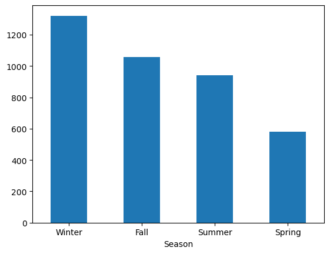
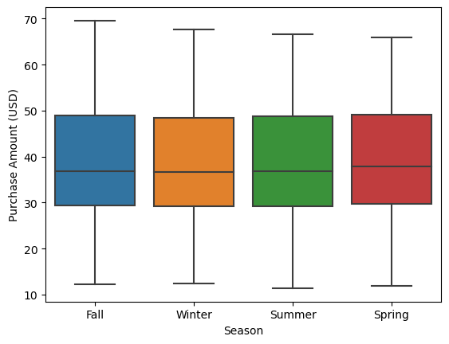

# Shopping-Behavior

## Project Overview

FlashFash American Market Analysis project. As a junior data analyst at FlashFash, the task is to analyze shopping behavior of American consumers following the company's recent IPO. The goal is to gain insights into consumer preferences, optimize inventory, and develop effective marketing strategies for the American market.

## Dataset Overview

The dataset (`data/raw/shopping.csv`) contains 3900 samples with 15 columns of simulated data. Each row represents a customer's shopping transaction, and the columns include information such as customer ID, age, gender, item purchased, purchase amount, location, and more.

### Columns
1. **Customer ID:** A unique identifier for tracking shopping behavior.
2. **Age:** Customer's age for segmentation and targeted marketing.
3. **Gender:** Identification of the customer's gender.
4. **Item Purchased:** Specific product selected during the transaction.
5. **Purchase Amount (USD):** Transaction value in United States Dollars.
6. **Location:** State of the order, revealing regional preferences.
7. **Size:** Specification for apparel, footwear, and certain goods.
8. **Color:** Variant influencing customer preferences.
9. **Season:** Influences customer preferences and product availability.
10. **Review Rating:** Customer's numerical satisfaction assessment.
11. **Shipping Type:** Method used for item delivery, affecting times and costs.
12. **Promo Code Used:** Indicates use of a promotional code or coupon.
13. **Previous Purchases:** Information on the customer's buying history.
14. **Payment Method:** Specifies the mode of payment.
15. **Frequency of Purchases:** Indicates customer purchasing activity.


## Project Workflow

### Part 1: Exploratory Data Analysis
#### Load data

```python
import pandas as pd

import matplotlib.pyplot as plt
import seaborn as sns

df = pd.read_csv('../data/raw/shopping.csv')
```
#### Visualizing data
- Univariate Analysis



- Bivariate Analysis



ex. Two examples of the many charts built in 01explore.ipynb

### Part 2: Data Transformation
- Clean and transform the dataset to answer primary questions
- Check for null values, drop columns, drop rows
- Save new DataFrame to "data/processed" folder in project 
```python
from pathlib import Path  

filepath = Path('../data/processed/shopping_cleaned.csv')

filepath.parent.mkdir(parents=True, exist_ok=True)  

dropped_df.to_csv(filepath, index=False)  
```

### Part 3: Aggregate Stats
#### Load data
```python 
import pandas as pd
import numpy as np

import matplotlib.pyplot as plt
import seaborn as sns

from scipy import stats

df = pd.read_csv('../data/processed/shopping_cleaned.csv')
```
#### Build pivot tables to uncover insights
```python
color_by_season_table = pd.pivot_table(df, values='Location', index='Color', columns='Season', aggfunc=len)
```

<div>
<style scoped>
    .dataframe tbody tr th:only-of-type {
        vertical-align: middle;
    }

    .dataframe tbody tr th {
        vertical-align: top;
    }

    .dataframe thead th {
        text-align: right;
    }
</style>
<table border="1" class="dataframe">
  <thead>
    <tr style="text-align: right;">
      <th>Season</th>
      <th>Fall</th>
      <th>Spring</th>
      <th>Summer</th>
      <th>Winter</th>
    </tr>
    <tr>
      <th>Color</th>
      <th></th>
      <th></th>
      <th></th>
      <th></th>
    </tr>
  </thead>
  <tbody>
    <tr>
      <th>Aubergine</th>
      <td>83</td>
      <td>2</td>
      <td>13</td>
      <td>111</td>
    </tr>
    <tr>
      <th>Baby blue</th>
      <td>16</td>
      <td>69</td>
      <td>84</td>
      <td>21</td>
    </tr>
    <tr>
      <th>Black</th>
      <td>84</td>
      <td>5</td>
      <td>9</td>
      <td>124</td>
    </tr>
    <tr>
      <th>Brick red</th>
      <td>88</td>
      <td>7</td>
      <td>12</td>
      <td>110</td>
    </tr>
    <tr>
      <th>Brown</th>
      <td>97</td>
      <td>5</td>
      <td>3</td>
      <td>89</td>
    </tr>
    <tr>
      <th>Burnt orange</th>
      <td>93</td>
      <td>4</td>
      <td>5</td>
      <td>112</td>
    </tr>
    <tr>
      <th>Fuchsia</th>
      <td>3</td>
      <td>45</td>
      <td>78</td>
      <td>18</td>
    </tr>
    <tr>
      <th>Lavender</th>
      <td>13</td>
      <td>55</td>
      <td>102</td>
      <td>6</td>
    </tr>
    <tr>
      <th>Lemon yellow</th>
      <td>9</td>
      <td>47</td>
      <td>98</td>
      <td>13</td>
    </tr>
    <tr>
      <th>Mauve</th>
      <td>86</td>
      <td>5</td>
      <td>7</td>
      <td>95</td>
    </tr>
    <tr>
      <th>Muted mustard yellow</th>
      <td>84</td>
      <td>8</td>
      <td>13</td>
      <td>87</td>
    </tr>
    <tr>
      <th>Pale peach</th>
      <td>9</td>
      <td>52</td>
      <td>81</td>
      <td>15</td>
    </tr>
    <tr>
      <th>Periwinkle</th>
      <td>9</td>
      <td>54</td>
      <td>82</td>
      <td>8</td>
    </tr>
    <tr>
      <th>Ruby Red</th>
      <td>90</td>
      <td>3</td>
      <td>8</td>
      <td>107</td>
    </tr>
    <tr>
      <th>Terra cotta</th>
      <td>91</td>
      <td>4</td>
      <td>15</td>
      <td>101</td>
    </tr>
    <tr>
      <th>Turquoise</th>
      <td>7</td>
      <td>49</td>
      <td>74</td>
      <td>16</td>
    </tr>
    <tr>
      <th>White</th>
      <td>10</td>
      <td>63</td>
      <td>81</td>
      <td>11</td>
    </tr>
  </tbody>
</table>
</div>

#### Questions

* What are the most popular colors by season?
* What is the most popular clothing item by season?
* What is the effect of promo-codes on the dollar-amount of purchases?
* When do users leave a review?
* Do states vary in the items they purchase in the Fall?

## Conclusion and Further Steps

### We uncovered a number of insights

- A bimodal distribution in Purchase Amounts that can be attributed to the use of a promo code
- Primary means of shipping, primary forms of payment
- Spending broken out by season
- Most popular colors for each season
- etc.

### Challenges

- Areas to improve upon are data transformation

### Further steps

- Continue looking at seasonality of purchases via gender, location, previous purchases
- Cluster analysis 
- Discuss strategies to incentivize keeping loyal customers, attracting new cutomers, and satisfying disaffected customers
